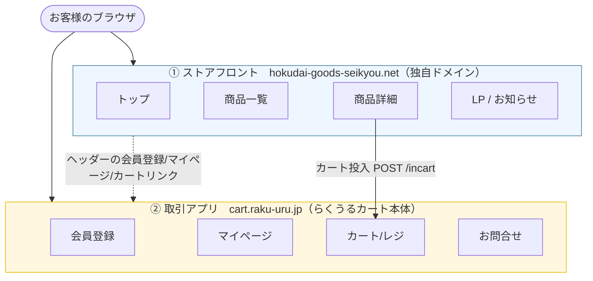
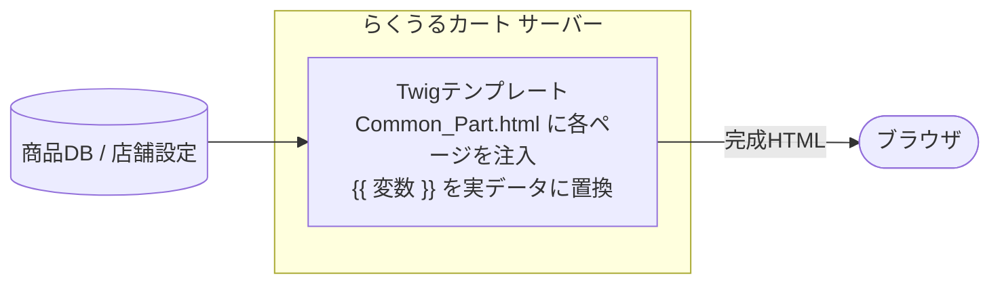
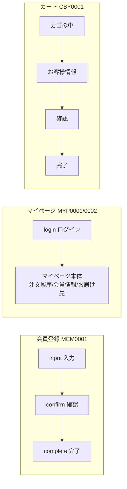
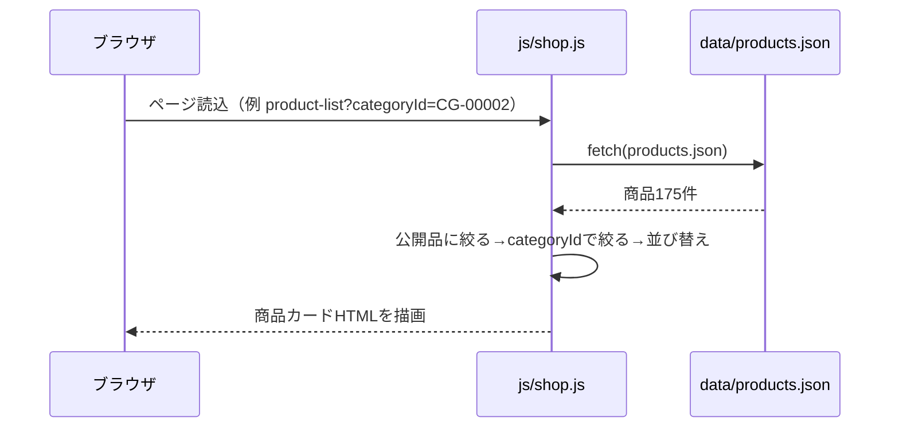
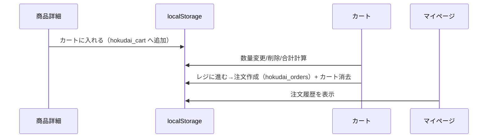

# らくうるカート 本番環境の構造 と ローカル再現の対応

このドキュメントは、本番サイト **[hokudai-goods-seikyou.net](https://hokudai-goods-seikyou.net/)** が
使っている EC ASP **「らくうるカート」** の構造を解説し、ローカル環境がそれをどう再現しているかを対応づけます。
（運用手順は [README.md](../README.md)、テンプレート変数・URL・データモデルの詳細仕様は [RAKUURU-SPEC.md](RAKUURU-SPEC.md) を参照）

---

## 1. 全体像：らくうるカートは「2ドメイン構成」

らくうるカートで作られたショップは、役割の異なる **2つのドメイン** で動いています。ここが最初に掴むべき最重要ポイントです。

| | ① ストアフロント | ② 取引アプリ |
|---|---|---|
| ドメイン | `hokudai-goods-seikyou.net`（独自ドメイン） | `cart.raku-uru.jp`（ASP共通） |
| 役割 | 見せる（トップ・商品・LP・お知らせ） | 売る（会員・カート・レジ・注文） |
| デザイン | 店舗が自由にカスタム（テーマHTML/CSS） | ASP画面を店舗テーマで薄く上書き |
| URL | `/`, `/product-list`, … | `/cart/{hash}`, `/member/regist/input/{hash}`, … |

**`{hash}`（店舗ハッシュ）** … `47409ca9deadd2be6543f3c2fc49d40f`。取引アプリのURL末尾に付き、どの店舗かを識別する。

---

## 2. ストアフロントの描画（本番）

本番のストアフロントは **サーバーサイドレンダリング（SSR）**。Twig テンプレートに商品データや設定を
差し込んで、完成したHTMLを返します。

- **共通枠 `Common_Part.html`** … ヘッダー/フッター/サイドバーの共通レイアウト。各ページ本体（商品一覧など）を
  `<[-- MAIN_CONTENTS --]>` の位置に流し込んで1枚のHTMLにする。
- **Twig変数** … `{{ shopName }}`, `{{ shpCartUrl }}`, `{{ dsnTopDesc1Shop }}`, `{{ shpImgUrl }}` などを
  サーバーが実値へ置換。商品ループは ``。
- **テーマCSS `getCss`** … 色などの店舗テーマは `cart.raku-uru.jp/getCss/{hash}` が動的生成（`{{ buttonColor }}` 等を解決済みのCSSとして配信）。

原本テンプレートは [`original/`](../original/) にあります（**分析専用・変更禁止**）。ローカルとの対応は [MAPPING.md](MAPPING.md)。

---

## 3. 取引アプリ（cart.raku-uru.jp）のURL構造

会員・カート・マイページは ASP 本体の画面で、**`/{機能}/{段階}/{hash}`** という規則的なURLを持ちます。
各画面には `MEM0001D01` のような **画面ID** が振られています（`<body id="...">` で確認できる）。

| 画面 | 本番URL | 画面ID |
|---|---|---|
| ショッピングカート | `/cart/{hash}` | CBY0001D01 |
| 会員登録 入力 | `/member/regist/input/{hash}` | MEM0001D01 |
| 会員登録 確認 | `/member/regist/confirm/{hash}` | MEM0001D02 |
| 会員登録 完了 | `/member/regist/complete/{hash}` | MEM0001D03 |
| マイページ ログイン | `/mypage/login/{hash}` | MYP0001D01 |
| マイページ 本体 | `/mypage/{hash}` | MYP0002D01 |

---

## 4. 本番 vs ローカル：何をどう代替したか

ローカルには「サーバー」も「DB」も無いので、本番のサーバー処理を **静的ファイル＋ブラウザJS** に置き換えています。

| 観点 | 本番（らくうるカート） | ローカル再現 |
|---|---|---|
| HTMLの生成 | サーバーがTwigでSSR | 静的HTML＋[js/shop.js](../js/shop.js)がJSで描画 |
| 商品データ | 商品DB（``） | [data/products.json](../data/products.json)（175件）を`fetch` |
| トップの差し込み | `{{ dsnTopDesc1Shop }}` 等をサーバーが注入 | `Shop.include()` が`data/*.html`を差し込み |
| テーマCSS | `getCss/{hash}` が動的生成 | 取得済みCSSを `cart/assets/theme.css` に固定 |
| 取引ページ | `cart.raku-uru.jp` のASP画面 | `cart/` に本番の生HTML＋実CSSを再現 |
| 会員/カート/注文の状態 | サーバーのセッション/DB | ブラウザの **localStorage** |
| フォーム送信 | サーバーへPOST | JSが受けてlocalStorageを更新 |
| URLルーティング | サーバールーティング | **フォルダ構成**で本番URLパスを再現 |

### データ駆動描画の流れ（ローカル）

### カート投入〜注文の流れ（ローカル）

> 本番では「カート投入」は商品詳細から `cart.raku-uru.jp/incart` へ HTMLフォームPOST（itemId等）。ローカルは同じ操作を
> localStorage で完結させています。localStorageのキーは [cart/README.md](../cart/README.md) に一覧。

---

## 5. URL ↔ フォルダ ↔ テンプレート 対応表

| 本番URL | ローカルのファイル | 本番テンプレート原本 |
|---|---|---|
| `/`（トップ） | `index.html` + `data/*.html` | `original/HTML/Toppage.html` |
| `/product-list` | `product-list.html` | `original/HTML/Product_List.html` |
| `/product-details?id=` | `product-details.html` | `original/HTML/Product_Details.html` |
| `/search?searchWord=` | `search.html` | `original/HTML/Product_Search.html` |
| `/fr/{n}`（お知らせ） | `fr/{n}.html` | （フリーページ） |
| LP | `lp/lp-〇〇/index.html` | `original/HTML/Landing_Page.html` |
| `cart.raku-uru.jp/cart/{hash}` | `cart/cart/index.html` | （ASP画面・生HTML取得して再現） |
| `.../member/regist/input/{hash}` | `cart/member/regist/input/index.html` | 同上 |
| `.../mypage/login/{hash}` | `cart/mypage/login/index.html` | 同上 |
| 共通枠 | 各HTMLに直書き | `original/HTML/Common_Part.html` |
| テーマ/共通CSS | `css/`, `cart/assets/` | `original/css/*.css`, `getCss` |

> **注意**：本番は `Common_Part.html` の1箇所でヘッダー/フッターを管理するが、ローカルは各HTMLにコピーしてある。
> ヘッダー/フッターを直すときは**全ローカルHTMLを横断修正**する必要がある。

---

## 6. 本番へ戻すときの考え方

ローカルは「本番の外枠（HTML/CSS/URL構造）はそのまま、中身の動的処理だけJS/localStorageで仮実装」した状態です。
移行はこの**仮実装層をサーバー処理に差し替える**イメージ：

| ローカルの仮実装 | 本番での置き換え先 |
|---|---|
| `shop.js` + `products.json` によるJS描画 | Twig `` によるSSR |
| `Shop.include()` の差し込み | `{{ dsnTopDesc1Shop }}` 等のTwig変数 |
| `cart-app.js` の localStorage 処理 | らくうるカートの会員/カート/注文サーバー処理 |
| 拡張子なしのクエリリンク（serve対策） | サーバールーティング（そのままでOK） |

各ページ冒頭の `<!-- 本番ルート: ... -->` コメントが、その画面の本番URL・画面IDを示す道しるべです。

---

## 参考リンク
- 運用手順 … [README.md](../README.md)
- 取引ページ詳細 … [cart/README.md](../cart/README.md)
- ローカル↔原本の対応 … [MAPPING.md](MAPPING.md)
- ドキュメント目次 … [README.md](README.md)
